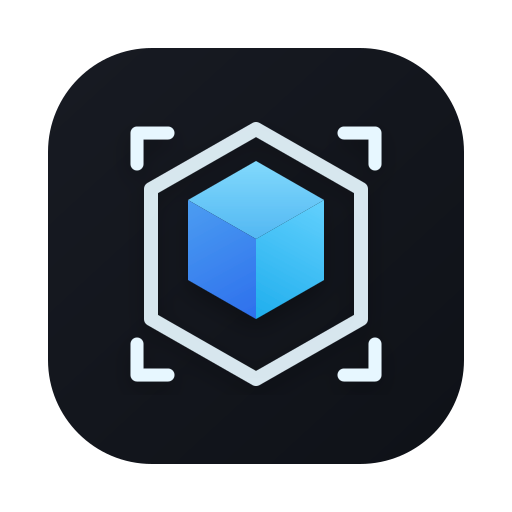

<p align="center">
  
</p>

<h1 align="center">AssetBox</h1>

<p align="center">
  <strong>3D Asset Quick Viewer & Organizer</strong><br/>
  3D 파일을 드래그하면 즉시 미리보기 + 메시 검증 + 썸네일 생성까지
</p>

<p align="center">
  <a href="https://github.com/sejoung/AssetBox/actions"></a>
  <a href="LICENSE"></a>
  
  
</p>

---

## Why AssetBox?

3D 아티스트가 FBX 하나 확인하려면 Blender나 Maya를 켜야 합니다.
텍스처 연결은 수동이고, 폴더 정리도 안 되어 있고, 썸네일도 없어서 파일 찾기가 힘듭니다.

> **AssetBox는 이 과정을 드래그 앤 드롭 한 번으로 줄입니다.**

---

## Features

### 3D Preview
- **FBX / GLB / OBJ** 파일 드래그 앤 드롭
- 회전 / 줌 / 팬 (모델 크기에 맞게 자동 조정)
- Studio 환경 라이팅

### View Modes
| Mode | Shortcut | Description |
|------|----------|-------------|
| **Solid** | `1` | 기본 렌더링 |
| **Wire** | `2` | 와이어프레임 (텍스처 제거, 토폴로지 확인) |
| **Normals** | `3` | 노멀 방향 시각화 (파란색=정상, 빨간색=뒤집힘) |
| **UV** | `4` | 체커보드 텍스처로 UV 매핑 확인 |

### Texture Auto-Matching
- `_basecolor`, `_normal`, `_roughness` 등 네이밍 규칙 기반 자동 탐색
- 내장 텍스처(GLB 등) 자동 인식

### Mesh Validation
6개 카테고리, 15개 이상의 검증 항목으로 메시 품질을 한눈에 확인:

| Category | Items |
|----------|-------|
| **Geometry** | Tris, Verts, Meshes, File Size, Degenerate Tris, Dimensions |
| **Topology** | Non-manifold Edges, Open Edges, Flipped Normals |
| **UV** | UV Coverage, UV Channels |
| **Texture** | Texture Count, Missing Textures, Max Resolution |
| **Material** | Material Count, No Material |
| **Transform** | Non-uniform Scale, Pivot Offset |

각 항목은 **Good / Warning / Bad** 등급으로 표시되며, 기준 초과 시 임계값 안내를 제공합니다.

### Thumbnail Generation
- 현재 뷰포트를 PNG로 캡처 (그리드 자동 제거)
- 모델 파일 옆에 `_thumbnail.png`으로 저장

### HTML Validation Report
- 전체 검증 결과를 HTML 리포트로 내보내기
- 카테고리별 상세 설명 + 항목별 한글 해설 포함
- 브라우저에서 바로 열어보기 / 이메일 공유 / 인쇄 가능

---

## Tech Stack

| Layer | Technology |
|-------|-----------|
| Desktop | [Tauri v2](https://v2.tauri.app/) |
| Frontend | React 18, TypeScript |
| 3D Rendering | Three.js, @react-three/fiber, @react-three/drei |
| Styling | TailwindCSS v4 |
| Backend | Rust |
| Testing | Vitest, Testing Library (70 tests) |
| Linting | ESLint, Prettier |
| CI/CD | GitHub Actions (macOS + Windows) |
| Build | Vite |

---

## Download

[Download the latest release](https://github.com/sejoung/AssetBox/releases/latest) or visit the [download page](https://sejoung.github.io/AssetBox/).

> **Note:** AssetBox is open-source and not code-signed. Your OS will show a security warning on first launch.
>
> **macOS:** After installing, open Terminal and run:
> ```bash
> xattr -cr /Applications/AssetBox.app
> ```
>
> **Windows:** Click "More info" → "Run anyway" in SmartScreen

---

## Getting Started (Build from Source)

### Prerequisites

- [Node.js](https://nodejs.org/) 24+
- [Rust](https://www.rust-lang.org/tools/install)
- Tauri v2 system requirements: [macOS](https://v2.tauri.app/start/prerequisites/#macos) | [Windows](https://v2.tauri.app/start/prerequisites/#windows) | [Linux](https://v2.tauri.app/start/prerequisites/#linux)

### Install & Run

```bash
# Clone
git clone https://github.com/sejoung/AssetBox.git
cd AssetBox

# Install dependencies
npm install

# Run in development mode
npm run dev

# Build for production
npm run build
```

### Scripts

| Command | Description |
|---------|-------------|
| `npm run dev` | Tauri 데스크톱 앱 개발 모드 |
| `npm run build` | 프로덕션 바이너리 빌드 |
| `npm run dev:web` | 프론트엔드만 브라우저 개발 |
| `npm test` | 전체 테스트 실행 |
| `npm run lint` | ESLint 체크 |
| `npm run format` | Prettier 자동 포맷 |
| `npm run release` | 패치 버전 태그 생성 |

---

## Project Structure

```
src/                              # Frontend (React + TypeScript)
├── components/
│   ├── DropZone.tsx              # Drag & drop zone
│   ├── Viewer3D.tsx              # Three.js 3D viewer + view modes
│   ├── ViewerToolbar.tsx         # Solid/Wire/Normals/UV toggle
│   ├── ModelLoader.ts            # FBX/GLB/OBJ loader + mesh analysis
│   ├── TextureMatcher.ts         # Auto texture matching
│   ├── InfoPanel.tsx             # Floating info overlay
│   ├── ValidationBadge.tsx       # Good/Warning/Bad badge
│   ├── ThumbnailButton.tsx       # Thumbnail capture
│   └── ReportButton.tsx          # HTML report export
├── hooks/
│   ├── useAssetValidation.ts     # 6-category validation logic
│   ├── useFileDropHandler.ts     # Tauri file drop events
│   └── useTauriCommand.ts        # Tauri IPC wrapper
├── lib/
│   ├── textureRules.ts           # Texture naming conventions
│   ├── reportGenerator.ts        # HTML report generator
│   └── overlayStyle.ts           # Shared overlay constants
└── types/
    └── asset.ts                  # TypeScript type definitions

src-tauri/                        # Backend (Rust)
├── src/
│   ├── lib.rs                    # Tauri app setup
│   ├── commands/
│   │   ├── file_scan.rs          # Directory scan & texture discovery
│   │   └── thumbnail.rs          # Save thumbnail/text files
│   └── models/
│       └── asset_info.rs         # Rust data structures

tests/                            # 70 tests across 9 suites
├── components/                   # UI component tests
├── hooks/                        # Validation logic tests
└── lib/                          # Utility tests
```

---

## Validation Thresholds

| Item | Good | Warning | Bad |
|------|------|---------|-----|
| Tris | < 100K | 100K ~ 500K | 500K+ |
| Verts | < 100K | 100K ~ 300K | 300K+ |
| Meshes | < 50 | 50 ~ 100 | 100+ |
| File Size | < 50MB | 50 ~ 100MB | 100MB+ |
| Max Texture | < 4096px | 4096 ~ 8192px | 8192px+ |
| Degenerate Tris | < 1% | 1 ~ 5% | 5%+ |
| Non-manifold | 0 | 1 ~ 50 | 50+ |
| Flipped Normals | 0 | < 10% | 10%+ |

---

## Contributing

Contributions are welcome! Please feel free to submit a Pull Request.

1. Fork the repository
2. Create your feature branch (`git checkout -b feature/amazing-feature`)
3. Commit your changes (`git commit -m 'feat: add amazing feature'`)
4. Push to the branch (`git push origin feature/amazing-feature`)
5. Open a Pull Request

---

## Roadmap

- [ ] Animation preview
- [ ] Batch processing (folder-level validation)
- [ ] Customizable validation thresholds
- [ ] A/B model comparison (LOD diff)
- [ ] Unreal/Unity engine integration
- [ ] Cloud asset management

---

## License

[Apache License 2.0](LICENSE)

---

<p align="center">
  Built with Tauri + React + Three.js + Rust
</p>
