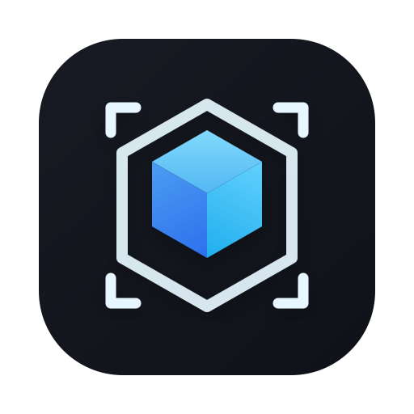

<p align="center">
  
</p>

<h1 align="center">AssetBox</h1>

<p align="center">
  <strong>3D Asset Quick Viewer & Organizer</strong><br/>
  3D 파일을 드래그하면 즉시 미리보기 + 메시 검증 + 썸네일 생성까지
</p>

<p align="center">
  <a href="https://github.com/sejoung/AssetBox/actions"></a>
  <a href="LICENSE"></a>
  
  
</p>

---

## Why AssetBox?

3D 아티스트가 FBX 하나 확인하려면 Blender나 Maya를 켜야 합니다.
텍스처 연결은 수동이고, 폴더 정리도 안 되어 있고, 썸네일도 없어서 파일 찾기가 힘듭니다.

> **AssetBox는 이 과정을 드래그 앤 드롭 한 번으로 줄입니다.**

---

## Features

### 3D Preview
- **FBX / GLB / OBJ** 파일 드래그 앤 드롭
- 회전 / 줌 / 팬 (모델 크기에 맞게 자동 조정)
- Studio 환경 라이팅

### File Browser
폴더를 드롭하거나 툴바에서 열면 좌측 탐색기에서 파일을 옮겨가며 연속 검수할 수 있습니다.
- **탐색기식 이동** — 브레드크럼 클릭 / `↑` 버튼으로 상위·하위 폴더 자유 이동
- 폴더 단위 lazy 로딩 (하위 폴더는 펼칠 때 읽음)
- **이름 검색** (`Cmd+F`) — 하위 폴더까지 재귀 검색, 결과는 평면 목록
- 검수한 파일은 행 왼쪽에 Checked / Review / Needs attention / Incomplete 색상 바로 표시, **문제만 보기** 필터 지원
- **Validate all** — 폴더 전체를 순회하며 일괄 검증 (진행률 / 취소 지원)
- 정렬: 이름 / 크기 / 수정일
- 우클릭 → Finder(탐색기)에서 보기 · 경로 복사 · 이 폴더 열기
- 생성된 썸네일을 행 아이콘으로 표시, 폴더 변경 자동 감지
- 마지막 위치·펼침 상태·정렬·패널 폭을 다음 실행에 복원

### View Modes
| Mode | Shortcut | Description |
|------|----------|-------------|
| **Solid** | `1` | 기본 렌더링 |
| **Wire** | `2` | 와이어프레임 (텍스처 제거, 토폴로지 확인) |
| **Normals** | `3` | 노멀 방향 시각화 (빨간색=면 방향과 정점 노멀 불일치) |
| **Normal Map** | `4` | 노멀을 색상으로 시각화 |
| **UV** | `5` | 체커보드 텍스처로 UV 매핑 확인 |
| **Retopo** | `6` | 삼각형 밀도와 형태 진단 |

### Rigging Information
- FBX·GLB·glTF의 본 이름·계층 검색, 스킨 연결·정점당 최대 본 영향 수 확인
- **Show bones** — 모델 위에 본 관절과 연결선 표시
- 애니메이션 클립 이름·길이·트랙 수 확인 (재생은 미지원)
- 내보낸 본·스킨 기준이며 Blender의 IK·컨트롤 리그는 검사하지 않음

### Texture Auto-Matching
- `_basecolor`, `_normal`, `_roughness` 등 네이밍 규칙 기반 자동 탐색
- 내장 텍스처(GLB 등) 자동 인식

### Mesh Validation
6개 카테고리, 15개 이상의 검증 항목으로 메시 품질을 한눈에 확인:

| Category | Items |
|----------|-------|
| **Geometry** | Tris, Verts, Meshes, File Size, Degenerate Tris, Dimensions |
| **Topology** | Non-manifold Edges, Open Edges, Normal Consistency |
| **UV** | UV Coverage, UV Channels |
| **Texture** | Texture Count, Missing Textures, Max Resolution |
| **Material** | Material Count, No Material |
| **Transform** | Non-uniform Scale, Pivot Offset |

각 항목은 **Checked / Review / Needs attention / Incomplete** 등급으로 표시되며, 기준 초과 시 임계값 안내를 제공합니다.

### Shortcuts
| Key | Action |
|-----|--------|
| `↑` / `↓` | 위 / 아래 항목으로 이동 (파일이면 즉시 로드) |
| `→` | 폴더 펼치기 / 첫 하위 항목으로 |
| `←` | 폴더 접기 / 상위 항목으로 (최상위에서는 상위 폴더로 이동) |
| `Enter` | 폴더 안으로 이동 |
| `Cmd`(`Ctrl`)`+F` | 검색 |
| `Cmd`(`Ctrl`)`+B` | 파일 탐색기 열기·닫기 |
| `F` | 모델에 포커스 |
| `1`~`6` | 뷰 모드 전환 |

### Thumbnail Generation
- 현재 뷰포트를 PNG로 캡처 (그리드 자동 제거)
- 모델 파일 옆에 `_thumbnail.png`으로 저장

### HTML Validation Report
- 전체 검증 결과를 HTML 리포트로 내보내기
- 카테고리별 상세 설명 + 항목별 한글 해설 포함
- 브라우저에서 바로 열어보기 / 이메일 공유 / 인쇄 가능

---

## Tech Stack

| Layer | Technology |
|-------|-----------|
| Desktop | [Tauri v2](https://v2.tauri.app/) |
| Frontend | React 18, TypeScript |
| 3D Rendering | Three.js, @react-three/fiber, @react-three/drei |
| Styling | TailwindCSS v4 |
| Backend | Rust |
| Testing | Vitest (136 tests), Rust unit tests (11) |
| Linting | ESLint, Prettier |
| CI/CD | GitHub Actions (macOS + Windows) |
| Build | Vite |

---

## Download

[Download the latest release](https://github.com/sejoung/AssetBox/releases/latest) or visit the [download page](https://sejoung.github.io/AssetBox/).

> **Note:** AssetBox is open-source and not code-signed. Your OS will show a security warning on first launch.
>
> **macOS:** After installing, open Terminal and run:
> ```bash
> xattr -cr /Applications/AssetBox.app
> ```
>
> **Windows:** Click "More info" → "Run anyway" in SmartScreen

---

## Getting Started (Build from Source)

### Prerequisites

- [Node.js](https://nodejs.org/) 24+
- [Rust](https://www.rust-lang.org/tools/install)
- Tauri v2 system requirements: [macOS](https://v2.tauri.app/start/prerequisites/#macos) | [Windows](https://v2.tauri.app/start/prerequisites/#windows) | [Linux](https://v2.tauri.app/start/prerequisites/#linux)

### Install & Run

```bash
# Clone
git clone https://github.com/sejoung/AssetBox.git
cd AssetBox

# Install dependencies
npm install

# Run in development mode
npm run dev

# Build for production
npm run build
```

### Scripts

| Command | Description |
|---------|-------------|
| `npm run dev` | Tauri 데스크톱 앱 개발 모드 |
| `npm run build` | 프로덕션 바이너리 빌드 |
| `npm run dev:web` | 프론트엔드만 브라우저 개발 |
| `npm test` | 전체 테스트 실행 |
| `npm run lint` | ESLint 체크 |
| `npm run format` | Prettier 자동 포맷 |
| `npm run release` | 패치 버전 태그 생성 |

---

## Project Structure

```
src/                              # Frontend (React + TypeScript)
├── components/
│   ├── DropZone.tsx              # Drag & drop zone
│   ├── Viewer3D.tsx              # Three.js 3D viewer + view modes
│   ├── ViewerToolbar.tsx         # Six view modes + background controls
│   ├── ModelLoader.ts            # FBX/GLB/OBJ loader + mesh analysis
│   ├── TextureMatcher.ts         # Auto texture matching
│   ├── InfoPanel.tsx             # Collapsible asset information panel
│   ├── ValidationBadge.tsx       # Inspection status badge
│   ├── ThumbnailButton.tsx       # Thumbnail capture
│   └── ReportButton.tsx          # HTML report export
│   ├── FileTreePanel.tsx         # File browser (navigation, search, batch)
│   └── FileTreeIcons.tsx         # Format-coloured row icons
├── hooks/
│   ├── useAssetValidation.ts     # 6-category validation logic
│   ├── useFileDropHandler.ts     # Tauri file/folder drop events
│   ├── useFileTree.ts            # Lazy directory tree state
│   ├── useBatchValidation.ts     # Folder-wide sequential validation
│   └── useTauriCommand.ts        # Tauri IPC wrapper
├── lib/
│   ├── textureRules.ts           # Texture naming conventions
│   ├── reportGenerator.ts        # HTML report generator
│   ├── fileTree.ts               # Tree state + flattening (pure)
│   ├── assetPipeline.ts          # load → scan → validate composition
│   ├── disposeScene.ts           # three.js resource teardown
│   ├── recentFolders.ts          # Recent folder persistence
│   ├── treeSession.ts            # Location / expansion / sort persistence
│   └── overlayStyle.ts           # Shared overlay constants
└── types/
    └── asset.ts                  # TypeScript type definitions

src-tauri/                        # Backend (Rust)
├── src/
│   ├── lib.rs                    # Tauri app setup
│   ├── commands/
│   │   ├── file_scan.rs          # Directory scan & texture discovery
│   ├── file_tree.rs          # Lazy listing, search & fs watcher
│   ├── reveal.rs             # Reveal in Finder / Explorer
│   │   └── thumbnail.rs          # Save thumbnail/text files
│   └── models/
│       └── asset_info.rs         # Rust data structures

tests/                            # 136 tests across 14 suites
├── components/                   # UI component tests
├── hooks/                        # Validation logic tests
└── lib/                          # Utility tests
```

---

## Validation

검사 결과는 용도에 맞춰 검토합니다. 성능 참고 예산 초과는 Review, 확인하지 못한 값은 Incomplete로 표시합니다. 실제 리소스 읽기 실패와 재질이 요구하는 UV 채널 누락 등은 Needs attention입니다.

검사 항목의 **Locate in model**을 클릭하면 해당 선·면·메시로 이동하고, 관련 재질과 텍스처 연결을 확인할 수 있습니다. 상세 패널에서 대상별로 이동하며, **Clear focus** 또는 **Escape**로 강조를 해제합니다. 실패한 리소스는 실제 경로를 표시합니다.

항목별 기준과 측정 한계는 [검사 가이드](docs/VALIDATION_GUIDE.md)를 참고하세요. 주변 텍스처 파일명으로 누락을 추정하지 않으며, 해상도는 실제 로드된 이미지에서 측정합니다.

---

## Documentation

- [검사 가이드](docs/VALIDATION_GUIDE.md) — 판정 의미, 개선 방향과 측정 한계

- [디자인 가이드 / Design guide (Korean)](docs/DESIGN_GUIDE.md) — UI 원칙, 공통 스타일, 반응형 배치, 상태별 동작과 변경 확인 목록
- 기능 상세: [한국어](docs/FEATURES_KO.md) · [English](docs/FEATURES_EN.md)
- 활용 가이드: [한국어](docs/GUIDE_KO.md) · [English](docs/GUIDE_EN.md)

---

## Contributing

Contributions are welcome! Please feel free to submit a Pull Request.

For UI changes, follow the [design guide](docs/DESIGN_GUIDE.md) and update it when shared design rules change.

1. Fork the repository
2. Create your feature branch (`git checkout -b feature/amazing-feature`)
3. Commit your changes (`git commit -m 'feat: add amazing feature'`)
4. Push to the branch (`git push origin feature/amazing-feature`)
5. Open a Pull Request

---

## Roadmap

- [ ] Animation preview
- [ ] Batch processing (folder-level validation)
- [ ] Customizable validation thresholds
- [ ] A/B model comparison (LOD diff)
- [ ] Unreal/Unity engine integration
- [ ] Cloud asset management

---

## License

[Apache License 2.0](LICENSE)

---

<p align="center">
  Built with Tauri + React + Three.js + Rust
</p>
